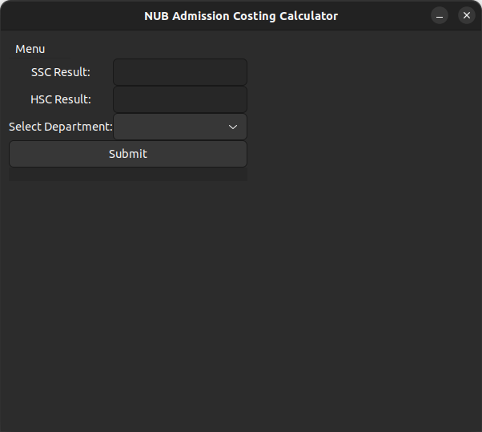
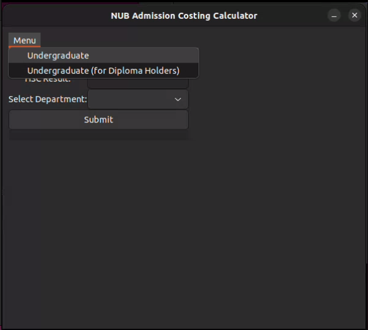
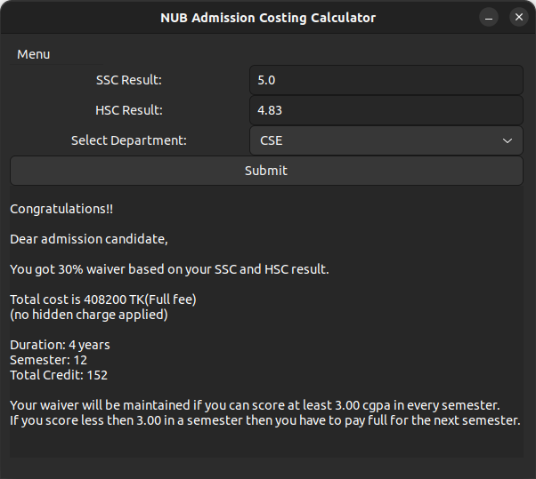

# Sample Lab Report: NUB Admission Costing Calculator

## Index
1. [Introduction](#introduction)
2. [Project Description](#project-description)
3. [Features and Functionality](#features-and-functionality)
4. [Used Frameworks and GUI](#used-frameworks-and-gui)
5. [Screenshot (Output)](#screenshot-output)
6. [User Manual](#user-manual)
    1. [Installation](#installation)
    2. [Setup](#setup)
    3. [Usage](#usage)

## Introduction
The NUB Admission Costing Calculator is designed to help admission candidates stay informed about the total admission cost at Northern University Bangladesh. This tool provides a clear and concise breakdown of costs associated with different undergraduate programs.

## Project Description
As mentioned, the NUB Admission Costing Calculator assists admission candidates in understanding the total admission costs for all departments at Northern University Bangladesh. Currently, it calculates the total cost for Undergraduate programs. The calculator addresses common confusions about program duration, semesters, credit hours, and waiver percentages.

## Features and Functionality
The NUB Admission Costing Calculator includes the following features:

- **Program Selection**: Allows candidates to select their desired undergraduate program.
- **Waiver Calculation**: Calculates the waiver percentage based on SSC and HSC results.
- **Cost Breakdown**: Provides a detailed breakdown of total costs.
- **Duration and Credit Hours**: Informs candidates about the total duration of the program, the number of semesters, and total credit hours.
- **Special Provision for Diploma Holders**: Provides a separate interface for diploma holders to calculate their admission costs.

## Used Frameworks and GUI
The project utilizes the following frameworks and GUI tools:

- **GTK3**: Used for creating the graphical user interface (GUI) of the application. GTK3 provides a comprehensive set of widgets for building desktop applications.

## Screenshot (Output)

### Default Interface of the Application
*This is the default interface of the application, accessible from Menu -> Undergraduate.*

### Menu Options
*This screenshot shows the options under the Menu bar.*

### Undergraduate Option Interface
*This screenshot shows the interface for the Undergraduate option.*

### Interface for Diploma Holders
*This screenshot shows the interface for the diploma holders option.*

_option.png)

## User Manual
### Installation
1. There are releases in the GitHub repository. Download the zip file from there or clone the repository.

### Setup
1. Install all dependencies such as GCC and GTK.
2. Run the make command.
3. The executable file is ready for use.

### Usage
1. **Undergraduate**: In the menu option, select "Undergraduate". Provide your SSC and HSC results, select the desired admission department, and submit. A message will pop up informing you about the waiver, total cost, duration, number of semesters, and credit hours.
2. **Undergraduate (for Diploma Holders)**: Select "Undergraduate (for Diploma Holders)" from the menu. Input your diploma results, select the desired admission department, and submit. A message will pop up informing you about the total cost, duration, number of semesters, and credit hours.

Note: For now, targeted users are on Linux kernel.
